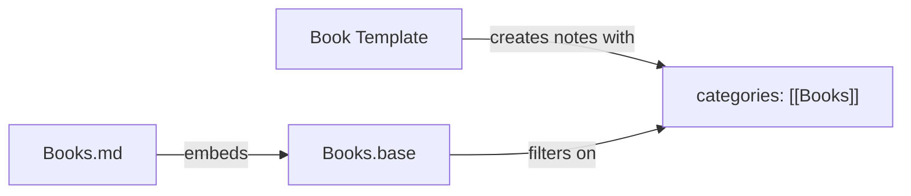

# Knowledge protocol

Full knowledge protocol for [[../SKILL.md|Superpaper]]: note types, epistemic contract, templates, categories, rating system, daily notes, journaling, meta layer, knowledge map specification, bookmark lifecycle, consolidation, and anti-patterns.

**Cross-references:** The [[../SKILL.md#Knowledge — your persistent knowledge graph|knowledge section]] in SKILL.md has the philosophy, operating loop, epistemic contract, and read/write protocols. This file has templates and detailed specs. [[rendering-guide.md|Rendering guide]] covers [[rendering-guide.md#Dynamic queries (Dataview plugin)|Dataview]] for querying knowledge, [[rendering-guide.md#Bases — vault usage patterns|Bases]] for database views, and [[rendering-guide.md#Frontmatter (YAML properties)|frontmatter rules]]. [[vault-structure.md#What goes where|Vault structure]] routes notes to the right folders.

---

## Note types (full descriptions)

Set `type` in frontmatter:
- **Fleeting** — raw thought, quick capture. Low bar to create. Most get discarded or promoted.
- **Source** — external material (article, book, podcast, conversation). Always has a `source` field.
- **Evidence** — a specific excerpt, quote, observation, or metric from a source. Granular and blockref-linkable (`^evidence`). Lives in `superpaper/.evidence/`.
- **Claim** — a compressive assertion that could be wrong. Must have confidence + evidence links + predictions ("if true, expect…").
- **Hypothesis** — a candidate causal or structural explanation. Links to the question it addresses, the claims it makes, and the experiments that could test it.
- **Permanent** — refined insight that survived scrutiny. High confidence. Densely linked.
- **Person** — anyone — contact, collaborator, mentor, author, public figure. Lives in `superpaper/people/`. Has `role`, `context`, `last-contact` fields.
- **Pattern** — domain-general structural essence (e.g. `[[pattern/feedback-loop]]`). Cross-domain hub that many notes link *to*.
- **Bridge** — explicit analogy map between two concepts/domains. What maps, what's preserved, where it breaks, what it predicts.
- **Analogy** — a deep structural parallel between distant domains. Goes beyond surface similarity to map *why* the parallel holds: shared constraints, isomorphic dynamics, common generating functions. The highest-leverage note type for cross-disciplinary insight — "cells are to organisms as employees are to companies" is surface; "both face principal-agent alignment problems under information asymmetry" is an analogy note. Links to the bridged concepts, names what transfers, and flags where the mapping breaks.
- **Model** — a formal structure (causal graph, mechanism, mathematical model) that explains how something works. Links to claims it supports and experiments that test it.
- **Question** — what we're trying to learn. A retrieval cue that pulls neighborhoods. Must track status (open/answered/superseded) and link to hypotheses and evidence.
- **Experiment** — a test plan with a prediction, procedure, and outcome. Links to the hypothesis it tests. Records whether the prediction held.
- **Dataset** — data provenance, version, and location. Links to the experiments and evidence it supports.
- **Decision** — why a choice was made. Links to the evidence, models, and claims that informed it. Records alternatives considered.
- **Run** — what an agent actually did. Timestamped execution record linking to the decision or task that triggered it and the artifacts produced.
- **Preference** — how someone thinks, works, or wants things done. Written by human *or* AI. Values, tastes, habits, constraints. Lives in `superpaper/meta/`. Preferences take precedence over general heuristics.
- **Idea** — creative hunch, brainstorm, what-if. Zero pressure. Lives in `superpaper/concepts/` with `type: idea`.
- **Reflection** — processing experiences, struggles, breakthroughs. Lives in `superpaper/personal/journal/reflections/`.
- **Log** — append-only living document. One file per topic (decisions, goals, learnings). Lives in `superpaper/personal/journal/`. Accumulates dated entries that link to atomic notes.
- **Bookmark** — external content the human found valuable (blog, tweet, video, podcast, link). Lands in `inbox/`, agent fetches and fully processes the original content into knowledge.

Types are structural roles — they define how a note behaves in the graph and which entity folder it lives in. Use `kind` for what it's about (fact, concept, procedure, principle, goal, habit, ritual, review, creation, prompt, recipe — open-ended, add your own). Use `#domains/` tags for the field (research, writing, software, philosophy, health, finance, spirituality, marketing, education, parenting — anything). The system is domain-agnostic by design.

---

## Knowledge note template

```markdown
---
type: fleeting
kind: fact | concept | procedure | principle | goal | habit | ritual | review | creation | prompt | recipe | preference | claim | pattern | bridge | idea | reflection |...
categories: []
id: ""
status: draft | active | supported | falsified | paused | superseded
confidence: 0.5
rating:
source: ""
via: ""
connections: []
created: YYYY-MM-DD
updated: YYYY-MM-DD
last: YYYY-MM-DD
superseded_by: ""
evidence_for: []
evidence_against: []
assumptions: []
predictions: []
next_actions: []
tags: []
aliases: []
relations:
  - type: "supports"
    target: "[[other-note]]"
  - type: "contradicts"
    target: "[[another-note]]"
---

One clear paragraph. What is this concept? Why does it matter? What does it imply? ^core-claim

## Relates

This builds on [[Other note]] by taking the idea further into territory X. It sits in tension with [[Another note]] — they disagree on Y, and that gap is worth exploring. A concrete instance of [[Parent concept]], seen through the lens of Z.

> [!info]- File history
> - YYYY-MM-DD — Created as fleeting. Reason.
```

The `relations` field in frontmatter makes connections queryable by Dataview. The `## Relates` body section is prose — readable without any tooling.

---

## Categories — multi-belonging without folders

Notes belong to categories via a `categories: ["[[Books]]", "[[Places]]"]` [[rendering-guide.md#Frontmatter (YAML properties)|property]]. A restaurant review can be `[[Places]]` AND `[[Recipes]]`. A person can be `[[People]]` AND `[[Companies]]`. Folders give physical location; categories give conceptual membership — a note can have many.

**The category trinity.** Every category is three files:

1. **Template** (`_templates/Book Template.md`) — frontmatter schema. Defines the properties every note in this category starts with.
2. **Base** (`_templates/Bases/Books.base`) — [[rendering-guide.md#Bases — vault usage patterns|database view]]. Filters on `categories.contains(link("Books"))`, defines columns, sorts, and multiple views (all, top-rated, by-author, by-genre).
3. **Category page** (`Books.md`) — hub note that embeds the base: `![[Books.base]]`. The human's browsable entry point. Lives wherever makes sense (root, `sources/`, `superpaper/`).

This trinity is the repeatable unit for growing the vault. When a new domain emerges (the human starts rating restaurants, tracking podcasts, logging trips), spin up all three. Base templates in `_templates/Bases/` make this instant — copy, rename, adjust the filter.



**Contextual views via `this`.** Bases become dynamic when they filter on the current note. A `Books.base` with a view `list(author).contains(this)` shows all books by an author — *when embedded on that author's page*. A `Places.base` with `list(loc).contains(this)` shows all places in a city — *when viewed from that city's note*. Design every base with at least one `this`-filtered view.

---

## Rating system (1–7)

Anything with a `rating` uses an integer from 1 to 7:

| Rating | Meaning |
|--------|---------|
| 7 | Perfect — life-changing, go out of your way |
| 6 | Excellent — worth repeating |
| 5 | Good — enjoyable, don't go out of your way |
| 4 | Passable — works in a pinch |
| 3 | Bad — avoid if you can |
| 2 | Atrocious — actively repulsive |
| 1 | Evil — life-changing in a bad way |

---

## Tracking properties

Two small properties with outsized value:

- **`last`** — when you last engaged with something (watched, read, visited, reviewed). Enables "recently experienced" and "haven't revisited in a while" views.
- **`via`** — who recommended it or how you found it (`via: "[[Alex]]"` or `via: "Hacker News"`). Creates a social graph of taste: "everything [[Alex]] recommended" becomes a single query.

---

## Daily note template

```markdown
---
type: daily
created: YYYY-MM-DD
---
```

**Daily notes are the human's space.** They exist solely to be linked to from the human's own entries — journal fragments, meals, workouts, meetings, moods. The value is in backlinks. No sections, no prompts, no friction.

**Agent logs are separate.** Agents link to `[[inbox/log/YYYY-MM-DD]]` — their own daily anchor. This keeps the human's daily note backlinks clean: only *their* life shows up, never agent task churn.

This is counterintuitive but powerful: an empty note with rich backlinks is more useful than a structured template the human feels guilty about not filling in. The daily note is a **date anchor**, not a form.

**Help the human build this habit.** When they create a journal fragment, link it to today: `[[2026-02-16]]`. When they log a meal, a workout, a meeting — link the date. Over time, each daily note becomes a dense web of everything that happened, without the human ever "writing" in it.

---

## Fractal journaling

Throughout the day, create timestamped thought fragments using Obsidian's unique note hotkey — each named `YYYY-MM-DD HHmm Title.md`. No structure required. Just capture. Link each fragment to today's daily note.

Every few days, review fragments and compile salient thoughts into a weekly review. Monthly reviews distill weekly reviews. Yearly reviews distill monthly reviews. The result is a **fractal web** you can zoom in and out of at varying detail.

| Cadence | Template | What it does |
|---------|----------|-------------|
| Daily | `YYYY-MM-DD HHmm Title.md` | Raw fragments — thoughts as they come |
| Weekly | `YYYY-[W]ww.md` | Compile the week's salient themes |
| Monthly | `YYYY-MM.md` | Distill monthly patterns, review weekly reviews |
| Yearly | `YYYY.md` | [40 questions](https://stephango.com/40-questions) — review the year's monthly reviews |

Review templates live in `_templates/`. The human traces back where individual thoughts came from and how they bubbled up into bigger themes. Create review templates as the cadence is adopted — don't front-load.

---

## Idea note template

```markdown
---
type: idea
created: YYYY-MM-DD
tags: []
---

What if...?

## Connects to

[[related concept]] — this matters because it challenges how we usually think about X.
```

---

## Reflection template

```markdown
---
type: reflection
created: YYYY-MM-DD
tags: []
---

## What happened


## What I felt


## What I learned


## What I'll do differently

```

---

## Person template

```markdown
---
type: person
role: ""
context: ""
last-contact: YYYY-MM-DD
created: YYYY-MM-DD
tags: []
aliases: []
---

How I know them. Why they matter. Key context.

## Connects to

[[related person or concept]] — shared context or collaboration.

> [!info]- File history
> - YYYY-MM-DD — Created. Reason.
```

---

## Place template

```markdown
---
type: source
categories: ["[[Places]]"]
loc: []
coordinates:
type: []
rating:
last: YYYY-MM-DD
via: ""
created: YYYY-MM-DD
tags: []
aliases: []
---

What this place is. Why it matters.
```

Place `type` values (e.g. `[[Restaurant]]`, `[[Museum]]`, `[[Park]]`, `[[Café]]`) are their own notes with `icon` and `color` properties — the `Map.base` looks up `list(type)[0].asFile().properties.icon` for marker appearance. `loc` is a list of location links (`["[[Kyoto]]", "[[Japan]]"]`). `coordinates` is a string `"lat,lng"` for map views.

---

## Reference templates — composable by design

Templates are **composable mixins**, not rigid forms. A contact who wrote a book gets both Person template and Author template applied. A restaurant that's also a recipe source gets Place + Recipe. Layer templates freely — properties merge.

Each template below implies the full **category trinity** — a template in `_templates/`, a base in `_templates/Bases/`, and a category page wherever it belongs. Create the trinity when the human first needs the category, not before.

| Template | Key properties | Base views |
|----------|---------------|-----------|
| Book | `author`, `genre`, `pages`, `year`, `rating`, `cover`, `isbn` | All, Top rated, By author (`list(author).contains(this)`), By genre (`list(genre).contains(this)`) |
| Movie / Show | `director`, `cast`, `genre`, `year`, `rating`, `runtime` | All, Top rated, By director, By genre |
| Place | `loc`, `coordinates`, `type`, `rating`, `last` | All, By location (`list(loc).contains(this)`), By type, Map view, Related (`file.hasLink(this)`) |
| Recipe | `cuisine`, `ingredients`, `author`, `rating` | All, By cuisine, By author |
| Trip | `loc`, `start`, `end`, `companions` | All, By location, Map view |
| Album | `artist`, `genre`, `year`, `rating` | All, Top rated, By artist, By genre |
| Product | `brand`, `price`, `rating`, `url` | All, By brand, Top rated |
| Quote | `author`, `source` | All, By author |
| Podcast / Episode | `host`, `guests`, `url`, `rating` | All, By host, By guests |

All reference notes use `categories` for cross-cutting retrieval and the 7-point `rating` scale. Shared properties (`genre`, `author`, `rating`, `last`) work across categories — one query surfaces all sci-fi across books, movies, and shows.

---

## Bookmark template

```markdown
---
type: bookmark
kind: url | image | text | mixed
source: ios | share-sheet
url: ""
status: unprocessed | processed | failed
rating:
via: ""
created: YYYY-MM-DD
tags:
  - inbox
  - "#domains/..."                 ← add domain tag(s) during processing
---

(URL, text, or image reference goes here)
```

### Bookmark processing lifecycle

When a bookmark arrives in `inbox/`:

1. **Fetch full content** — retrieve the original page, article, video transcript, podcast transcript, or tweet thread. Follow [[../SKILL.md#Working with external sources|external source processing]]. Use web search aggressively to get the complete primary source and all its references and details about the author(s).
2. **Flag failures** — if content can't be fetched (paywalled, deleted, private), set `status: failed` and add a `> [!warning] Content could not be fetched` callout with the reason. Still process whatever metadata is available.
3. **Enrich the bookmark** — add a `## Summary` and `## Key ideas` section to the bookmark note itself. Add `#domains/` tags and a `rating` (1–7) if quality is assessable. The bookmark becomes the source — no separate source note needed. NEVER manually rewrite the source content; quote or transclude it.
4. **Extract insights** — pull key claims, evidence, and ideas into atomic knowledge notes in `concepts/`, `.evidence/`, etc. Every extracted note MUST link back to the bookmark file (`[[bookmark-title]]`) so the base views can surface it via `file.link`.
5. **Connect to graph** — link new notes to existing knowledge. Surface cross-domain bridges.
6. **Move to library** — set `status: processed`, move to `sources/bookmarks/` (see [[vault-structure.md#What goes where|what-goes-where routing]]). The bookmark is now browsable in `Bookmarks.base` with `file.link` as the primary navigation column.

---

## Anti-patterns

- **Hoarding** — more notes ≠ smarter. Fewer, denser, better-linked notes = smarter. Prune ruthlessly.
- **Orphans** — a note with no links is invisible to the graph. Always connect.
- **Duplicates** — search first. Strengthen an existing note rather than creating a parallel one.
- **Vagueness** — "interesting idea about X" is worthless. Be precise: "X works because Y, which implies Z for context W."
- **Premature permanence** — don't mark notes permanent until they've proven useful. Let fleeting notes earn promotion.

---

## Consolidation (periodic)

- **Random revisit** — help user do this: use the random note hotkey to walk the vault randomly. Fix formatting, create missing links, find inspiration in past thoughts. Use the local graph at shallow depth to see related notes. This is intentionally manual — "doing this maintenance helps me understand my own patterns." Don't automate what builds understanding.
- **Merge** notes that evolved into the same insight → keep one, mark others with `superseded_by`
- **Strengthen** connections between notes that keep co-occurring in retrievals
- **Promote** fleeting notes that survived 7+ days and got referenced. When promoting, force three moves: (1) link to 1–3 `[[pattern/...]]` notes, (2) add a "breaks when…" boundary, (3) name one cross-domain analogy.
- **Prune** — `obsidian orphans` lists notes with zero inbound links; `obsidian deadends` finds notes with no outbound links
- **Find bridges** — two-hop scan: A ↔ B ↔ C but A not linked to C → propose a bridge or hypothesis
- **Harvest contradictions** — every `contradicts` link should generate a question or experiment note if one doesn't exist
- **Update** the knowledge map with new clusters and entry points
- **Review journal** — surface patterns from `personal/journal/` entries (recurring struggles, energy trends, growth areas)
- **Promote ideas** — revisit `type: idea` notes in `concepts/`; mature hunches get promoted to permanent or become project seeds
- **Review meta** — reread `meta/` before planning. Has alignment drifted? Are decision patterns repeating? Is taste sharpening or flattening? Update stale meta notes. This is the self-referential loop.

---

## Meta — the self-referential layer (`superpaper/meta/`)

`meta/` is the vault's consciousness. The only folder where **both human and AI write about themselves, each other, and the system itself**. Every other folder stores knowledge *about the world*. Meta stores knowledge *about how we think, choose, and collaborate* — and it feeds back into every future action.

Both writers introspect here. The human captures how they reason, what they value, where they struggle. The AI captures what it's learned about the human, where alignment breaks down, what calibration drifts it notices. Over time, meta becomes the long-horizon memory that makes execution compound.

The [[../SKILL.md#Growth orientation|growth orientation]] and [[../SKILL.md#Modes|interaction modes]] (especially reflective friend) connect directly to how meta notes are used.

**Four dimensions:**

1. **Alignment** — mutual understanding between human and AI. Trust calibration. Where communication works, where it breaks. What the human *actually* means vs. what they say. What the AI misreads. Notes here are the tuning weights of the partnership.
2. **Decision-making** — how choices get made. Frameworks, heuristics, biases, failure modes. Both parties log reasoning patterns — the human's tendencies under pressure, the AI's default assumptions. Review these before high-stakes moves.
3. **Risk-taking** — appetite for uncertainty. Comfort zones and growth edges. When to push, when to hold. The human's relationship with failure. The AI's tendency toward safety vs. boldness. Calibrate together.
4. **Taste** — the subtle, high bar for ideas. What "good" looks like across domains. Aesthetic sensibility, quality thresholds, intellectual standards. Taste is the hardest thing to transfer — these notes are how it happens.

**Write protocol for meta:**
- After any significant interaction where alignment shifted, either party writes a brief meta note.
- After a decision that went well or poorly, capture *why* the reasoning worked or didn't.
- When the AI notices a pattern in the human's behavior (or vice versa), name it here.
- Review meta before long-horizon planning, high-stakes decisions, or creative work — it's the calibration surface.

Meta notes are living documents. Update them as understanding deepens. A preference note from month one should look different by month six — not because the preference changed, but because the understanding of *why* sharpened.

---

## Knowledge map (`superpaper/Knowledge map.md`)

The knowledge map is the browsable entry point to the knowledge graph. It uses [[rendering-guide.md#Dynamic queries (Dataview plugin)|Dataview queries]] and [[rendering-guide.md#Bases — vault usage patterns|Bases embeds]] extensively. It should contain:

- **`## Clusters`** — groups of related notes that emerge as knowledge accumulates. Each cluster has a name, a one-line description, and links to its key notes.
- **`## Recent additions`** — a live Dataview query:
  ````markdown
  ```dataview
  TABLE type, confidence, created
  FROM "superpaper"
  WHERE type AND type != "daily"
  SORT created DESC
  LIMIT 10
  ```
  ````
- **`## Stats`** — a DataviewJS block counting total notes by type and average links per note.
- **`## Open questions`** — `LIST FROM "superpaper/questions" SORT created DESC`
- **`## Low-confidence claims`** — `TABLE confidence FROM "superpaper/concepts" WHERE type = "claim" AND confidence <= 0.55 SORT updated DESC`
- **`## Contradictions`** — `LIST FROM "superpaper" WHERE contains(file.outlinks, "contradicts") SORT updated DESC`
- **`## Bookmarks`** — embed `![[Bookmarks.base#Library]]` for a browsable read-later library. The human can scan, filter, and discover connections without leaving the knowledge map.
- **`## Vault health`** — embed `![[Knowledge health.base#Overview]]` for a live, interactive dashboard (if the base exists). Falls back gracefully if not yet created.
