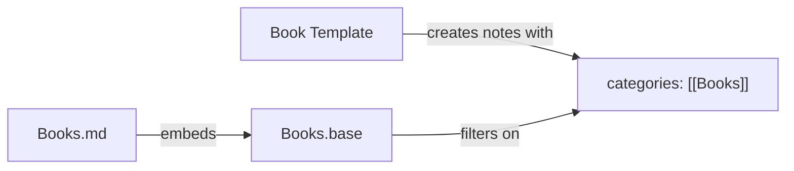

# Knowledge protocol

Full knowledge protocol for [[../SKILL.md|Superpaper]]: note types, epistemic contract, templates, categories, rating system, daily notes, journaling, meta layer, knowledge map specification, bookmark lifecycle, consolidation, and anti-patterns.

**Cross-references:** The [[../SKILL.md#Knowledge — your persistent knowledge graph|knowledge section]] in SKILL.md has the philosophy, operating loop, epistemic contract, and read/write protocols. This file has templates and detailed specs. [[rendering-guide.md|Rendering guide]] covers [[rendering-guide.md#Dynamic queries (Dataview plugin)|Dataview]] for querying knowledge, [[rendering-guide.md#Bases — vault usage patterns|Bases]] for database views, and [[rendering-guide.md#Frontmatter (YAML properties)|frontmatter rules]]. [[vault-structure.md#What goes where|Vault structure]] routes notes to the right folders.

---

## Note types (full descriptions)

Set `type` in frontmatter:
- **Fleeting** — raw thought, quick capture. Low bar. Most get discarded or promoted.
- **Permanent** — refined insight that survived scrutiny. High confidence. Densely linked.
- **Source** — external material (article, book, podcast, conversation). Always has a `source` field. Evidence lives inline as block-referenced passages.
- **Claim** — an assertion that could be wrong. Has `confidence` + evidence links. Subsumes hypotheses and models.
- **Analogy** — a deep structural parallel between distant domains. Maps *why* the parallel holds, what transfers, where it breaks. Subsumes patterns and bridges.
- **Question** — what we're trying to learn. A retrieval cue that pulls neighborhoods.
- **Experiment** — a test plan with prediction, procedure, and outcome.
- **Decision** — why a choice was made. Links to evidence and alternatives considered.
- **Person** — contact, collaborator, author, public figure. Lives in `people/`.
- **Preference** — how someone thinks, works, or wants things done. Lives in `meta/`. Takes precedence over heuristics.
- **Idea** — creative hunch, brainstorm, what-if. Zero pressure.
- **Reflection** — processing experiences, struggles, breakthroughs. Lives in `personal/journal/`.
- **Log** — append-only living document. Accumulates dated entries.
- **Bookmark** — external content worth processing. Lands in `inbox/`, gets enriched and moved to `sources/`.
- **Daily** — nothing is written here. Exists solely to be linked *to*. Value is in backlinks.

These are the built-in types — the human can add, rename, or remove types as their system evolves. Two axes organize everything: `type` is the structural role (how a note behaves in the graph), `categories` is the browse axis (what it's about). Use `#domains/` tags for the field. The system is domain-agnostic by design.

---

## Knowledge note template

Every note begins with six fields. The `created-by` field tracks authorship provenance — `human`, `ai`, or `ai-assisted`. Templates default to `human`; agents override to `ai` when they create a note. **How this works automatically:** Templater's "trigger on new file creation" is set to apply `Knowledge note.md` as the empty file template — so every note the human creates (hotkey, unique note, file explorer) gets `created-by: human` without thinking about it. Add more fields when the note earns them:

```markdown
---
type: fleeting
categories: []
created: YYYY-MM-DD
created-by: human
tags: []
aliases: []
---

One clear paragraph. What is this concept? Why does it matter? What does it imply? ^core-claim

## Relates

This builds on [[Other note]] by taking the idea further into territory X. It sits in tension with [[Another note]] — they disagree on Y, and that gap is worth exploring. A concrete instance of [[Parent concept]], seen through the lens of Z.

> [!info]- File history
> - YYYY-MM-DD — Created as fleeting. Reason.
```

| When | Add |
|------|-----|
| It asserts something | `confidence` (0–1) |
| It could be wrong | `status` (`draft` · `active` · `supported` · `falsified` · `superseded`) |
| It references external material | `source`, `url` |
| It's worth rating | `rating` (1–7) |
| A belief changed | `superseded_by` link to replacement |

The `## Relates` body section is prose — readable without any tooling. Relation types (*supports, contradicts, part of, depends on, causes, example of*) emerge from the sentence, not label it.

---

## Categories — multi-belonging without folders

Notes belong to categories via a `categories: ["[[Books]]", "[[Places]]"]` [[rendering-guide.md#Frontmatter (YAML properties)|property]]. A restaurant review can be `[[Places]]` AND `[[Recipes]]`. A person can be `[[People]]` AND `[[Companies]]`. Folders give physical location; categories give conceptual membership — a note can have many.

**The category trinity.** Every category is three files:

1. **Template** (`_templates/Book Template.md`) — frontmatter schema. Defines the properties every note in this category starts with.
2. **Base** (`_templates/Bases/Books.base`) — [[rendering-guide.md#Bases — vault usage patterns|database view]]. Filters on `categories.contains(link("Books"))`, defines columns, sorts, and multiple views (all, top-rated, by-author, by-genre).
3. **Category page** (`superpaper/categories/Books.md`) — hub note that embeds the base: `![[Books.base]]`. The human's browsable entry point. Lives in `superpaper/categories/`.

The most common trinities (26 categories, 36 bases — including 11 utility bases — and 14 note templates) **ship with the repo** — see `_templates/AGENTS.md` for the full inventory. When a new domain emerges (the human starts rating restaurants, tracking podcasts, logging trips), spin up all three. Base templates in `_templates/Bases/` make this instant — copy, rename, adjust the filter.


```mermaid
graph LR
  T["Book Template"] -->|creates notes with| P["categories: [[Books]]"]
  B["Books.base"] -->|filters on| P
  H["Books.md"] -->|embeds| B
```

**Contextual views via `this`.** Bases become dynamic when they filter on the current note. A `Books.base` with a view `list(author).contains(this)` shows all books by an author — *when embedded on that author's page*. A `Places.base` with `list(loc).contains(this)` shows all places in a city — *when viewed from that city's note*. Design every base with at least one `this`-filtered view.

---

## Rating system (1–7)

Anything with a `rating` uses an integer from 1 to 7:

| Rating | Meaning |
|--------|---------|
| 7 | Perfect — life-changing, go out of your way |
| 6 | Excellent — worth repeating |
| 5 | Good — enjoyable, don't go out of your way |
| 4 | Passable — works in a pinch |
| 3 | Bad — avoid if you can |
| 2 | Atrocious — actively repulsive |
| 1 | Evil — life-changing in a bad way |

---

## Tracking properties

Two small properties with outsized value:

- **`last`** — when you last engaged with something (watched, read, visited, reviewed). Enables "recently experienced" and "haven't revisited in a while" views.
- **`via`** — who recommended it or how you found it (`via: "[[Alex]]"` or `via: "Hacker News"`). Creates a social graph of taste: "everything [[Alex]] recommended" becomes a single query.

---

## Evergreen notes

[Evergreen notes](https://stephango.com/evergreen-notes) turn ideas into objects you can manipulate. They have titles that distill each idea in a succinct, memorable way — usable in a sentence. Examples: *"A company is a superorganism"*, *"Everything is a remix"*, *"You have no obligation to your former self"*. You don't need to agree with the idea for it to become an evergreen note. They can be very short.

In the Superpaper system, evergreen notes are knowledge notes with `type: permanent`. They've earned promotion from fleeting through use, refinement, and linking. The `Evergreen.base` view surfaces all permanent notes sorted by backlink count — the most-referenced ideas float to the top.

**Proactive AI marking.** When the AI recognizes a human-written note as evergreen-caliber — a standalone insight with a sentence-like title that could compose into larger thinking — the AI should **suggest** promoting it to `type: permanent`. Never auto-promote; always confirm with the human first.

**Recognition signals:** The title works as a standalone statement. Referenced by 2+ notes. Survived 7+ days without being superseded. Captures a principle, pattern, or belief — not just information.

---

## Daily note template

```markdown
---
type: daily
created: YYYY-MM-DD
---
```

**Nothing is written in daily notes.** They exist solely to be linked *to* from other entries. All named `YYYY-MM-DD.md`, all in `daily/`. The value is entirely in backlinks.

This is counterintuitive but powerful: an empty note with rich backlinks is more useful than a structured template the human feels guilty about not filling in. The daily note is a **date anchor**, not a journal.

**Agent logs are separate.** Agents link to `[[inbox/log/YYYY-MM-DD]]` — their own daily anchor. This keeps the human's daily note backlinks clean: only *their* life shows up, never agent task churn.

**Help the human build this habit.** When they write a journal fragment, link it to today: `[[2026-02-16]]`. When they log a meal, a movie, a workout, a meeting — link the date. Over time, each daily note becomes a dense web of everything that happened, without the human ever writing *in* it.

**`Daily.base` is the daily note's dashboard.** Embed it on every daily note (`![[Daily.base]]`). The default view is **Human** — only `created-by: human` notes, so the daily note foregrounds the human's life, not agent churn. Four more views are a tab away: **Fragments** (journal fragments with `YYYY-MM-DD HHmm` prefix), **Reviews** (weekly/monthly/yearly reviews covering that date), **AI** (only `created-by: ai` or `ai-assisted` notes), and **Everything** (all notes regardless of authorship, with a `By` column). This is the primary surface for fractal review gathering — the [[fractal-review]] skill reads from these views.

---

## Fractal journaling

Throughout the day, capture individual thoughts using Obsidian's unique note hotkey — each named `YYYY-MM-DD HHmm Title.md`. These fragments live in the vault root (or wherever the human writes), not in `daily/`. No structure required. Just capture and link each fragment to today's daily note (`[[2026-02-16]]`).

Every few days, review fragments and compile salient thoughts into a weekly review. Monthly reviews distill weekly reviews. Yearly reviews distill monthly reviews. The result is a **fractal web** you can zoom in and out of at varying detail.

| Cadence | Template | What it does |
|---------|----------|-------------|
| Daily | `YYYY-MM-DD HHmm Title.md` | Raw fragments — thoughts as they come |
| Weekly | `YYYY-[W]ww.md` | Compile the week's salient themes |
| Monthly | `YYYY-MM.md` | Distill monthly patterns, review weekly reviews |
| Yearly | `YYYY.md` | [40 questions](https://stephango.com/40-questions) — review the year's monthly reviews |

Review templates (`Weekly review.md`, `Monthly review.md`, `Yearly review.md`) ship in `_templates/`. The [[fractal-review]] skill automates the preparation — gathering fragments, surfacing themes, preparing the review surface — while the human writes the actual review. The [[heartbeat]] checks cadences and triggers prep notes when reviews are due.

---

## Idea note template

```markdown
---
type: idea
created: YYYY-MM-DD
tags: []
---

What if...?

## Connects to

[[related concept]] — this matters because it challenges how we usually think about X.
```

---

## Reflection template

```markdown
---
type: reflection
created: YYYY-MM-DD
tags: []
---

## What happened


## What I felt


## What I learned


## What I'll do differently

```

---

## Person template

```markdown
---
type: person
role: ""
context: ""
last-contact: YYYY-MM-DD
created: YYYY-MM-DD
tags: []
aliases: []
---

How I know them. Why they matter. Key context.

## Connects to

[[related person or concept]] — shared context or collaboration.

> [!info]- File history
> - YYYY-MM-DD — Created. Reason.
```

---

## Place template

```markdown
---
type: source
categories: ["[[Places]]"]
loc: []
coordinates:
type: []
rating:
last: YYYY-MM-DD
via: ""
created: YYYY-MM-DD
tags: []
aliases: []
---

What this place is. Why it matters.
```

Place `type` values (e.g. `[[Restaurant]]`, `[[Museum]]`, `[[Park]]`, `[[Café]]`) are their own notes with `icon` and `color` properties — the `Map.base` looks up `list(type)[0].asFile().properties.icon` for marker appearance. `loc` is a list of location links (`["[[Kyoto]]", "[[Japan]]"]`). `coordinates` is a string `"lat,lng"` for map views.

---

## Reference templates — composable by design

Templates are **composable mixins**, not rigid forms. A contact who wrote a book gets both Person template and Author template applied. A restaurant that's also a recipe source gets Place + Recipe. Layer templates freely — properties merge.

Each template below implies the full **category trinity** — a template in `_templates/`, a base in `_templates/Bases/`, and a category page wherever it belongs. Create the trinity when the human first needs the category, not before.

| Template | Key properties | Base views |
|----------|---------------|-----------|
| Book | `author`, `genre`, `pages`, `year`, `rating`, `cover`, `isbn` | All, Top rated, By author (`list(author).contains(this)`), By genre (`list(genre).contains(this)`) |
| Movie / Show | `director`, `cast`, `genre`, `year`, `rating`, `runtime` | All, Top rated, By director, By genre |
| Place | `loc`, `coordinates`, `type`, `rating`, `last` | All, By location (`list(loc).contains(this)`), By type, Map view, Related (`file.hasLink(this)`) |
| Recipe | `cuisine`, `ingredients`, `author`, `rating` | All, By cuisine, By author |
| Trip | `loc`, `start`, `end`, `companions` | All, By location, Map view |
| Album | `artist`, `genre`, `year`, `rating` | All, Top rated, By artist, By genre |
| Product | `brand`, `price`, `rating`, `url` | All, By brand, Top rated |
| Quote | `author`, `source` | All, By author |
| Episode | `podcast`, `host`, `guests`, `url`, `published`, `topics`, `status` | All, By podcast, Unprocessed, With papers, Connected |

All reference notes use `categories` for cross-cutting retrieval and the 7-point `rating` scale. Shared properties (`genre`, `author`, `rating`, `last`) work across categories — one query surfaces all sci-fi across books, movies, and shows.

---

## Bookmark template

```markdown
---
type: bookmark
source: ios | share-sheet
url: ""
status: unprocessed | processed | failed
rating:
via: ""
created: YYYY-MM-DD
tags:
  - inbox
  - "#domains/..."                 ← add domain tag(s) during processing
---

(URL, text, or image reference goes here)
```

### Bookmark processing lifecycle

When a bookmark arrives in `inbox/`:

1. **Fetch full content** — retrieve the original page, article, video transcript, podcast transcript, or tweet thread. Follow [[../SKILL.md#Working with external sources|external source processing]]. Use web search aggressively to get the complete primary source and all its references and details about the author(s).
2. **Flag failures** — if content can't be fetched (paywalled, deleted, private), set `status: failed` and add a `> [!warning] Content could not be fetched` callout with the reason. Still process whatever metadata is available.
3. **Enrich the bookmark** — add a `## Summary` and `## Key ideas` section to the bookmark note itself. Add `#domains/` tags and a `rating` (1–7) if quality is assessable. The bookmark becomes the source — no separate source note needed. NEVER manually rewrite the source content; quote or transclude it.
4. **Extract insights** — pull key claims and ideas into atomic knowledge notes in `concepts/`. Every extracted note should link back to the bookmark file (`[[bookmark-title]]`) so the base views can surface it via `file.link`.
5. **Connect to graph** — link new notes to existing knowledge. Surface cross-domain bridges.
6. **Move to library** — set `status: processed`, move to `sources/bookmarks/` (see [[vault-structure.md#What goes where|what-goes-where routing]]). The bookmark is now browsable in `Bookmarks.base` with `file.link` as the primary navigation column.

---

## Anti-patterns

- **Monolithic notes** — a long note covering five ideas is five missed connections. Split into atoms first, then compose a hub that embeds them. The atoms are reusable; the monolith isn't.
- **Top-down summaries** — writing a summary that paraphrases sources instead of embedding them (`![[source#^finding]]`) destroys attribution and creates drift. Summarize with connective prose *between* embeds, not *instead of* them.
- **Hoarding** — more notes ≠ smarter, but more *atomic, well-linked* notes absolutely = smarter. The distinction matters: a vault of 500 dense atoms with 3+ links each is exponentially more valuable than 50 long notes with 1 link each. Prune vague notes; split dense ones.
- **Orphans** — a note with no links is invisible to the graph. Always connect.
- **Duplicates** — search first. Strengthen an existing note rather than creating a parallel one.
- **Vagueness** — "interesting idea about X" is worthless. Be precise: "X works because Y, which implies Z for context W."
- **Premature permanence** — don't mark notes permanent until they've proven useful. Let fleeting notes earn promotion.
- **Unattributed claims** — a quote, finding, or idea without a link to its source (person, paper, book, conversation) loses provenance. Every atom should trace to where it came from.

---

## Consolidation (periodic)

- **Random revisit** — help user do this: use the random note hotkey to walk the vault randomly. Fix formatting, create missing links, find inspiration in past thoughts. Use the local graph at shallow depth to see related notes. This is intentionally manual — "doing this maintenance helps me understand my own patterns." Don't automate what builds understanding.
- **Split monoliths** — scan for notes covering multiple concepts. Split each idea into its own atomic note, then replace the original with a hub that embeds the atoms. Every split increases the graph's connectable surface area.
- **Extract unattributed atoms** — find quotes, findings, or claims embedded in longer notes without their own note or `^block-id`. Give each one a block ID or its own note so it's independently linkable. A quote by a person should be its own note linked to that person's `people/` entry.
- **Merge** notes that evolved into the same insight → keep one, mark others with `superseded_by`
- **Strengthen** connections between notes that keep co-occurring in retrievals
- **Promote** fleeting notes that survived 7+ days and got referenced. When promoting, force three moves: (1) link to 1–3 `[[pattern/...]]` notes, (2) add a "breaks when…" boundary, (3) name one cross-domain analogy.
- **Audit embed composition** — check hub notes and project deliverables: are they embedding atomic notes or rewriting content? Convert paraphrased sections to transclusions (`![[atom#^core-claim]]`) wherever possible.
- **Prune** — `obsidian orphans` lists notes with zero inbound links; `obsidian deadends` finds notes with no outbound links
- **Find bridges** — two-hop scan: A ↔ B ↔ C but A not linked to C → propose a bridge or hypothesis
- **Harvest contradictions** — every `contradicts` link should generate a question or experiment note if one doesn't exist
- **Update** the knowledge map with new clusters and entry points
- **Review journal** — surface patterns from `personal/journal/` entries (recurring struggles, energy trends, growth areas)
- **Promote ideas** — revisit `type: idea` notes in `concepts/`; mature hunches get promoted to permanent or become project seeds
- **Review meta** — reread `meta/` before planning. Has alignment drifted? Are decision patterns repeating? Is taste sharpening or flattening? Update stale meta notes. This is the self-referential loop.

---

## Meta — the introspective core (`superpaper/meta/`)

`meta/` is the deepest layer of the system — where the partnership thinks about how it thinks. Every other folder stores knowledge *about the world*. Meta stores knowledge *about how we think, choose, and collaborate* — and it feeds back into every future action. Both human and AI write here.

Meta is organized into **dimensions** — open-ended aspects of the partnership that deepen over time. Common starting points: alignment, decision-making, risk-taking, taste. But the set grows as the partnership matures — new dimensions are *noticed*, not planned. When you see a pattern across 2–3 interactions that doesn't fit an existing dimension, name it and propose a new one.

Every note in `meta/` is a **progressive amendment** — linked to the one before it, forming a trail of how understanding changed. This makes every decision auditable, every taste judgment traceable, every shift in alignment explainable. Early notes will be rough. Precision comes from revision.

The [[../SKILL.md#Growth orientation|growth orientation]] and [[../SKILL.md#Modes|interaction modes]] (especially reflective friend) connect directly to how meta notes are used.

**When to write meta:**
- The AI notices a preference, reasoning pattern, or taste signal → seed a note or amend an existing dimension.
- A decision went well or poorly → capture *why* the reasoning worked or didn't.
- Alignment shifted → name the shift.
- Review meta before long-horizon planning, high-stakes decisions, or creative work.

**Seeding:** If `meta/` is empty, that's the most important thing to fix. After any meaningful interaction, write the first meta note — even one observation is enough to start a dimension. The AI seeds and proposes; the human validates and sharpens. See the [[../SKILL.md#Meta — the introspective core|meta section]] in SKILL.md and the [[introspect]] skill for the full audit framework.

---

## Knowledge map (`superpaper/Knowledge map.md`)

The knowledge map is the browsable entry point to the knowledge graph. It uses [[rendering-guide.md#Dynamic queries (Dataview plugin)|Dataview queries]] and [[rendering-guide.md#Bases — vault usage patterns|Bases embeds]] extensively. It should contain:

- **`## Clusters`** — groups of related notes that emerge as knowledge accumulates. Each cluster has a name, a one-line description, and links to its key notes.
- **`## Recent additions`** — a live Dataview query:
  ````markdown
  ```dataview
  TABLE type, confidence, created
  FROM "superpaper"
  WHERE type AND type != "daily"
  SORT created DESC
  LIMIT 10
  ```
  ````
- **`## Stats`** — a DataviewJS block counting total notes by type and average links per note.
- **`## Open questions`** — `LIST FROM "superpaper/questions" SORT created DESC`
- **`## Low-confidence claims`** — `TABLE confidence FROM "superpaper/concepts" WHERE type = "claim" AND confidence <= 0.55 SORT updated DESC`
- **`## Contradictions`** — `LIST FROM "superpaper" WHERE contains(file.outlinks, "contradicts") SORT updated DESC`
- **`## Bookmarks`** — embed `![[Bookmarks.base#Library]]` for a browsable read-later library. The human can scan, filter, and discover connections without leaving the knowledge map.
- **`## Vault health`** — embed `![[Knowledge health.base#Overview]]` for a live, interactive dashboard (if the base exists). Falls back gracefully if not yet created.
